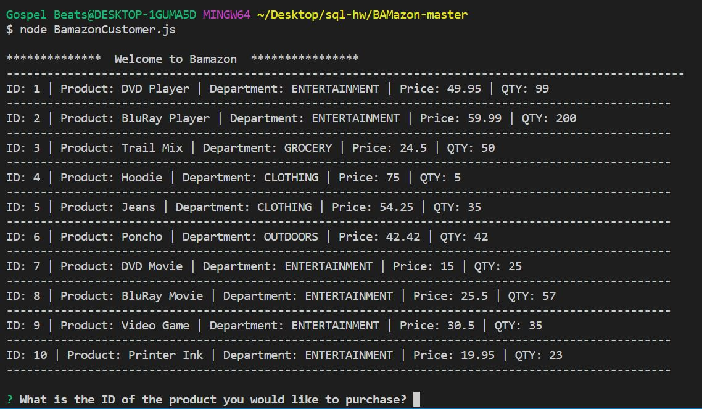
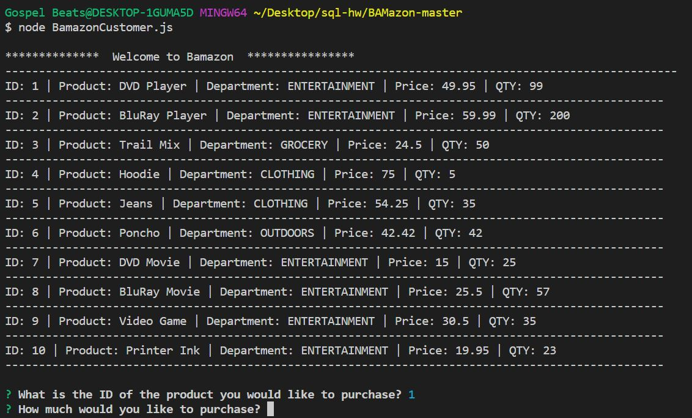
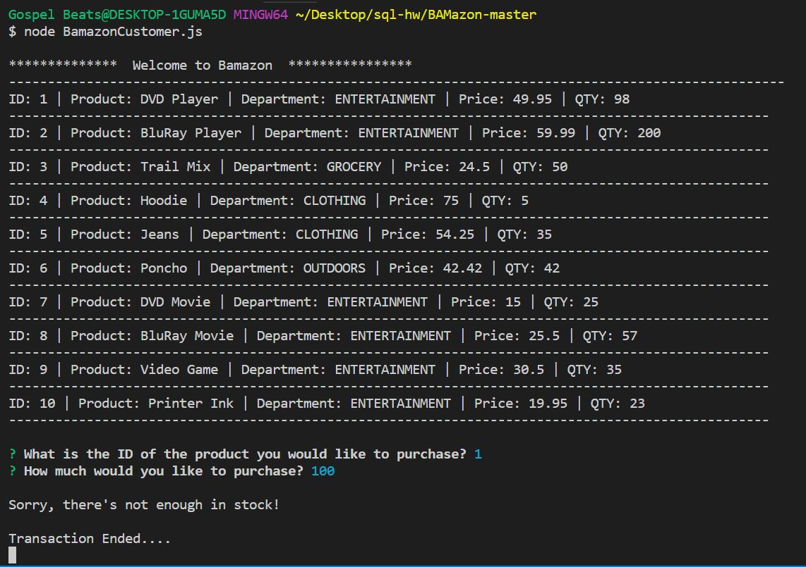
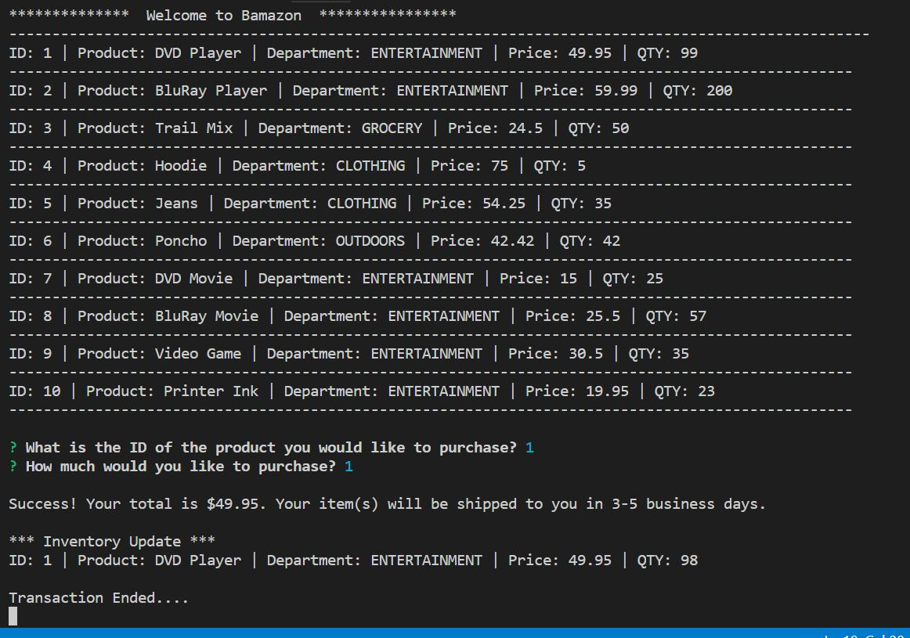

# Amazon Like Store Front 

## Bamazon built with Node.js & MySQL

Description: Command Line Interface APP that take in orders from customers and deplete stock from the store's inventory.

- Data Persist in MySQL Database called `bamazon`.

- Table inside of that database called `products`.

- Products table columns are:

   * item_id (unique id for each product)

   * product_name (Name of product)

   * department_name

   * price (cost to customer)

   * stock_quantity (how much of the product is available in stores)

- Database includes 10 different products. 

- Node application called `bamazonCustomer.js`. Running this application will first display all of the items available for sale. 

- The app will prompt users with two messages.

   * The first question ask user the ID of the product they would like to buy.
   * The second question ask how many units of the product they would like to buy.

- Once the customer has placed the order, the application will check if the store has enough of the product to meet the customer's request.

- If not, the app logs a phrase like `Insufficient quantity!`, and then prevent the order from going through.

- If the store does have enough of the product, the app fulfills the customer's order.
- The mySQL database will update and reflect the remaining quantity.
- Once the update goes through, the app shows the customer the total cost of their purchase.

## Getting Started:

Run npm install

## Screenshots

Type in the product id

How many of that product do you want to buy

There're not enough inventory in stock

Purchase successful results

